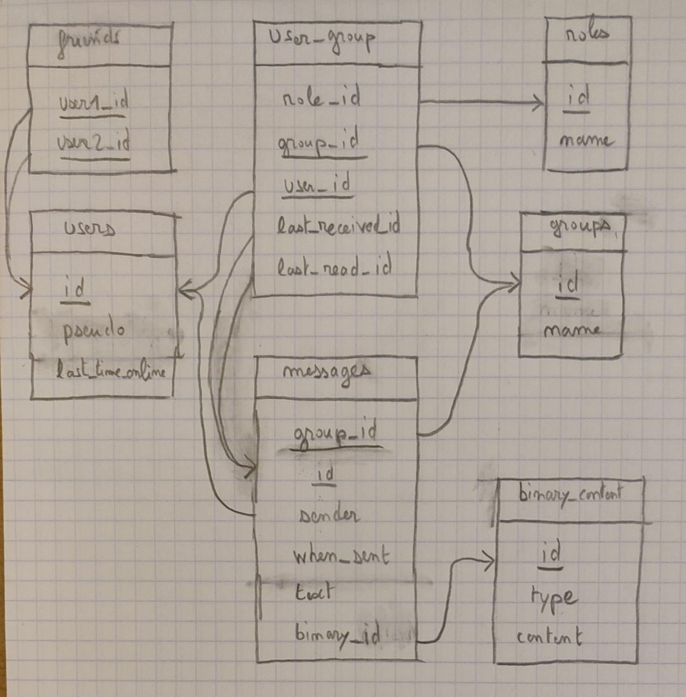

# Conception

## Objets à synchroniser avec la base de donnée

### User
- **id (int)**: numéro identifiant l'utilisateur de manière unique
- pseudo (String): pseudonyme  de l'utilisateur
- lastTimeOnLine (DateTime): dernière fois où le user était en ligne
- groupList (groupe[]): liste des groupes auquel il appartient

### Group
- **id (int)**: numéro identifiant le groupe de manière unique
- name (String): nom du groupe
- userList (User[]): liste des utilisateurs appartenant au groupe

### UserGroup (table d'association)
- **group (Group)**
- **user (User)**
- roleIid (int): identifiant du rôle de l'utilisateur dans le groupe
- lastReceivedId: id du dernier message reçu par l'utilisateur dans le groupe
- lastReadId: id dernier message lu par l'utilisateur dans le groupe

### Role
- **id (int)**: numémro identifiant le rôle de manière unique
- name: nom du rôle (administrateur, utilisateur, etc)

### Message
- **id (int)**: numéro identifiant le message de manière unique sur le groupe auquel il appartient
- group (Group): groupe auquel le message appartient
- sender (User): utilisateur ayant envoyé le message
- whenSent (DateTime): date et heure d'envoi du message
- text (String): texte du message
- binaryContent (BinaryContent): contenu binaire éventuel (image, fichier, etc)

### BinaryContent
- **id**: numéro identifiant le contenu de manière unique
- type (String): type du contenu binaire
- content (byte[]): contenu binaire

### Fiends (table d'association)
- **user1_id** (int)
- **user2_id** (int)

## Objets non sauvegardés en base de donnée
### UserWithDetails (extends User)
- isOnLine (Bool): booléen indiquant si le user est en ligne actuellement